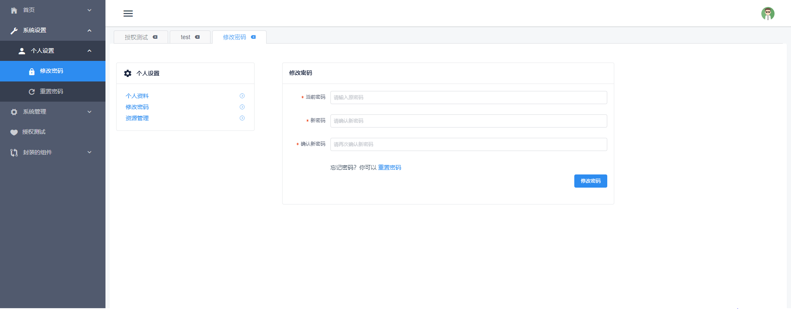

# 我的个人学习记录

本项目使用 vue + iview + node.js + express + mongodb 技术栈进行搭建，主要用于记录个人学习进程
项目域名：thinkingbig.club
如需登录该系统，测试账号：admin，密码：admin

**项目源码地址**：<https://github.com/jazzyXie/integrated_pro>

## 已实现功能一览

1. github 授权登录，并获取 github 授权信息
2. jwt 权限验证
3. 权限路由
4. 自行封装 axios 工具类
5. 编写 RESTful API
6. 实现基本的后台管理系统布局的框架及功能模板
7. 实现用户注册、登录、退出登录、修改用户密码接口和相关功能
8. 基于 iview 封装了侧边栏下拉列表等组件
9. 使用 vue-virtual-scroll-list 插件进行虚拟渲染，实现百万级数据量的下拉列表无缝渲染



## 如何启动前端项目？

```
1. 项目下载到本地后，您可以使用 npm install 安装依赖包
2. 安装依赖成功后，使用 npm run serve 以开发模式运行项目 或 使用 npm run build 打包代码，输出到 dist 文件夹
```

## 如何启动后端项目？

```
1. 项目下载到本地后，您可以使用 npm install 安装依赖包
2. 安装依赖成功后，使用 nodemon app.js 或 npm run start 运行，后端服务端口为 80
```

##项目目录结构

```
	integrated_pro
		|-- dist	   			// npm run build 打包输出目录
		|-- server          // 服务端代码目录
			|-- api    // 后端接口
        |-- authen.js
        |-- table_data.js
        |-- user.js
      |-- db    // 数据库
        |-- menulist_db.js
        |-- models.js
        |-- user_db.js
      |-- utils   // 工具类
        |-- github.js
      |-- app.js    // 后端项目入口文件
      |-- package.json    // 后端项目配置信息
		|-- src     			//
			|-- api   // 接口
        |-- data.js
        |-- github.js
        |-- index.js
        |-- user.js
      |-- assets  // 静态资源
      |-- components    // 封装的组件目录
        |-- header-bar
        |-- side-menu
        |-- slide-verify
      |-- lib   // 库文件 / 工具类
        |-- authenByGithub.js
        |-- axios.js
        |-- tools.js
        |-- utils.js
      |-- router    // 路由
        |-- index.js
        |-- router.js
      |-- store   // vuex 状态管理
        |-- module
          |-- github.js
          |-- router.js
          |-- tabNav.js
          |-- user.js
        |-- actions.js
        |-- index.js
        |-- mutations.js
        |-- state.js
        |-- store.js
      |-- views   // 页面文件
        |-- common
        |-- homepage
        |-- layout
        |-- login
        |-- personalsettings
        |-- sys_management
      |-- app.vue
		|-- main.js   // 入口文件
		|-- vue.config.js   // vue-cli 配置
		|-- package.json    // 前端项目配置信息
```

如果本项目对您的学习有帮助，欢迎 star，也欢迎大家一起学习和交流
